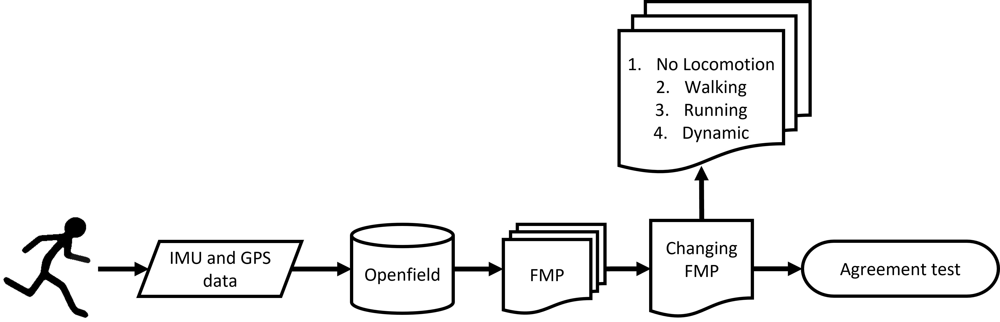
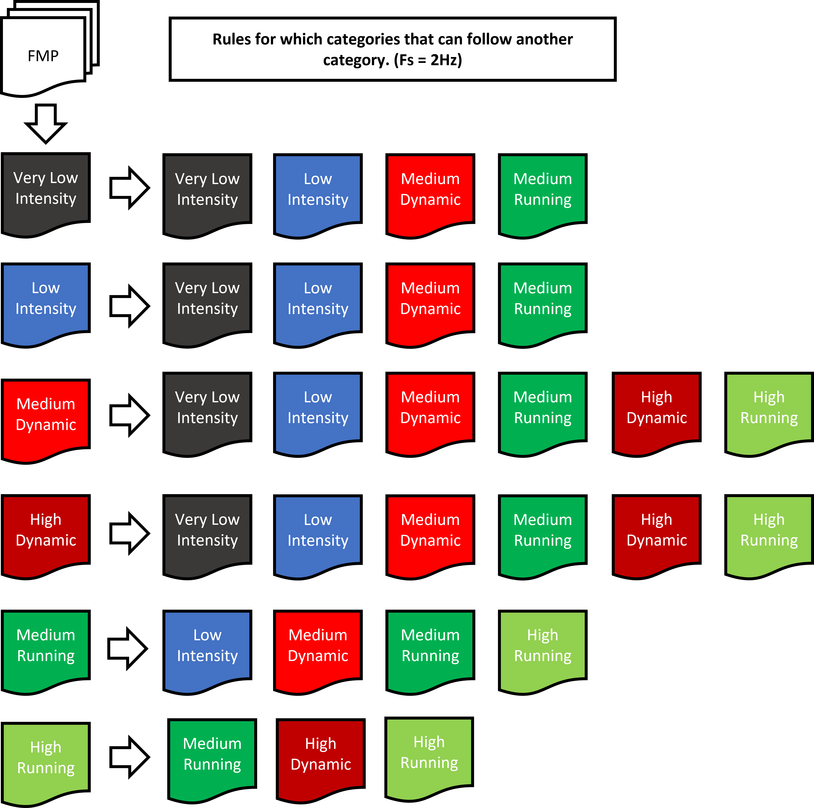

# Method

Fourty-one elite youth football players from a Swedish approved elite sports high school participated in the study (36 males and 5 females, $17.4 \pm 0.8$ yrs old,  $180.1 \pm 7.6$ cm, $70.3 \pm 8.7$ kg). All participants signed a participation consent form (REFERENCE TO APPENDIX). Players that were below the age of 18 had a parent / legal guardian to sign the form. Each player wore a catapult vest with the Catapult Vector X7 device, on the back between the scapulae. The X7 contains an IMU and a GPS. The IMU consists of a triaxial accelerometer and gyroscope with a range of $\pm 16g$, and $2000^{\circ}/s$ respectively, which collected data, at 1000Hz then downsampled to 100Hz before entering the proprietary software, Openfield (v XX, firmware vXX). A magnetometer was also part of the IMU (see figure \@ref(fig:globalSystem) for the IMU orientation). The GPS collected data at 10hz and determines distance from positional differentiation and velocity from the Doppler shift technique. Furthermore, the FMP that was used during this study was derived from the acceleration data measured by the aforementioned IMU. 

```{r globalSystem, fig.cap = "Orientation of the IMU sensor", echo = FALSE, out.width = "70%", fig.align = "center"}
knitr::include_graphics("img/globalSystem.png")
```

Videos were recorded with a Canon VIXIA HF G50 4K camcorder at 50fps and a resolution of 1920x1080 pixels. The camera was placed differently, depending on the drill that was executed. Details on this will follow in each respective section. To ensure synchronization between the IMUs and the cameras, all participants were instructed to stand still for a few seconds, then perform 3 jumps and subsequently stand still for a few seconds again before performing a drill. This was controlled for by the football instructor who also had the responsibility of teaching the players how to perform the different drills.
**Originally the video material from the cameras would also be used for expert labelling of the player movements. However, doing to unforeseen circumstances this idea was omitted.**

The players were divided into three groups (depended on their high school year). Two groups participated across two days. First day was outside on a football field, second day was inside a tent with a football field made from artificial grass. The last group only participated one day, inside the tent. The tent was used during heavy rain that would have affected the stiffness of the surface and therfore affected the movement patterns of the players (eg. sliding during change of directions).
The quality of the GPS data was still high during data collection inside the tent (> 6 satellites, < 1 HDOP) \citep{Malone2017} with only very few critical samples, as can be seen in figure \@ref(fig:gpsQuality). 

```{r gpsQuality, fig.cap = "Top plots showing the Horizontal Dilution of Precision (HDOP). Bottom plot showing the number of sattelites connected to the GPS.", echo = FALSE, out.width = "100%", fig.align = "center"}
knitr::include_graphics("img/gpsQuality.jpeg")
```

```{r, echo = FALSE, out.width = "100%"}
# library(kableExtra)
# library(tidyverse)
# 
# quality <- data.frame(
#   Outdoor = c("$16.01 \\pm 1.04$",
#               "$6.49$",
#               "$0.68 \\pm 0.06$",
#               "$8.19$"),
#   Indoor = c("$14.35 \\pm 1.68$",
#              "$11.73$",
#              "$0.77 \\pm 0.13$",
#              "$16.81$")
# )
# 
# knitr::kable(as.data.frame(t(quality)), col.names = c("N", "CV $[\\%]$", "Distance $[m]$", "CV $[\\%]$"), 
#              escape = F, format = "latex", align = "c",
#              caption = "Super plot") %>% 
#   kable_minimal() %>% 
#   add_header_above(c(" " = 1, "Satellites" = 2, "HDOP" = 2)) %>% 
#   kable_styling(latex_options = c("striped", "HOLD_position"))
```

## Data collection

The data collection consisted of two categories of drills. The controlled drills and the football specific drills. The controlled drills were used for validation of the locomotion type (eg. linear or non-linear). The football specific drills were used for developing of an algorithm that can predict drill types. 

### Controlled drills

The controlled drills consisted of subcategories; First the linear locomotion drills were performed then the non-linear locomotion drills.
The linear locomotion drills consisted of 5 different velocities; 5.4, 12, 18, 19.8 and 21.6 km/h. Velocities were controlled for, by the placement of cones on the football field and the players were instructed to pass the next cone at each sounding bip, which were repeated every 3 s from a loudspeaker. All players for the respective group moved at the same time. When the players got to the other end of the field a short break of approximately 30-60s was held before the next iteration would start. Camera was positioned sagital to the players, To ensure they were recognizable, they were placed in numeric order relative to their shirt number.

The non-linear locomotion drill consisted of 3 different intensities. The players would run to the middle of a circle and then out to the cones that was placed at the circles edge all the way around the circle: For the lowest intensity, players were instructed to pass the next cone at the sounding of a bip that were repeated every 3 s. Second iteration they were instructed to perform it as quick as possible. The third iteration they would again do it as quick as possible, but only for half the circle before they were done (see figure \@ref(fig:locomotion)). The camera was placed at the frontal angle relative to the players starting position to easily identify the shirt number.


```{r locomotion, fig.cap = "Practical setup for the linear (A to E) and non-linear (F) locomotion data collection", echo = FALSE, out.width = "100%", fig.align = "center"}
knitr::include_graphics("img/allLocomotion.png")
```


### Football specific drills

A total of four different drills were conducted. 16x12, 22x12, bigdrill.

TEXT WILL COME LATER


## Data processing

### Controlled Drills

All IMU (Fs = 100Hz) and GPS (Fs = 10Hz) data was exported from Openfield software. FMP (Fs = 1Hz) was exported from Catapults Openfield cloud, Vision 
Exporter. **To validate the locomotion part of the categories a change was made to omit the intensity as the intensity is not possible to properly validate, as there are no real golden standard to compare acceleration loads in football with. Additionally, each company uses their own proprietary values to differentiate between the load, as there are several factors influencing the outcome; signal processing, the IMU and sport of interest.**

The "Very Low Intensity" category was renamed to "No locomotion", "Low Intensity" to "Walking" and the the "medium" and "high" intensity from dynamic and running was removed, leaving with a total of four categories instead of six (see figure \@ref(fig:flowchartAgreement)).

* **No Locomotion** - Standing-like movements
* **Walking** - Walking-like movements
* **Linear Locomotion** - Steady jogging, medium- and high-speed running
* **Non-linear Locomotion** - Mid- and high intensity changes of direction and accelerations

To ensure steady-state running during the linear locomotion drill, all the data from the start to the first cone and from the second to last to the last cone was removed. As these would consist of acceleration and deceleration movements.
These categories where then validated with a percentage-agreement test relative to the controlled drills from figure \@ref(fig:locomotion)).

```{r flowchartAgreement, fig.cap = "Flowchart off the data from collection to agreement test.", echo = FALSE, out.width = "100%", fig.align = "center"}

```

### Football specific drills
THIS IS NEW:

The specific drills were used to investigate the possibility to predict drill types based on the FMP categories (with intensities). Before attempting to predict the drills a feature engineering process was conducted to improve the FMP while also creating features that can help predict drill types. 
**Features is a term used to describe any measurable input (variable) for a predictive model. Feature engineering is a process of creating new features by manipulating and transforming the raw data. Eg: The magnitude of accelerations ($\sqrt{x^2+y^2+z^2}$) is a feature based on the three individual components.**

The resolution of the FMP was increased to 2Hz by simply doubling all the predictions and arranged correctly relative to the time domain. Then a category transition ruleset was applied (see figure \@ref(fig:FMPruleset)). The ruleset was applied to restrict the FMP from predicting certain categories as a function of the former category, $category_n$ is dependent on $category_{n-1}$. Eg: If the current category is *Low Intensity* we can only transition to one of the four categories to the right of it. 

**The ruleset is based on newtons third law; *For every action, there is an equal and opposite re-action* while also considering the internal differences between the categories. For example, if an athlete stands still (s)he will not be able to produce enough force to transition into the high intensity categories right away, as the force production will be relatively low compared to a change of direction occurring doing high intense running.**

\begin{center}
```{r FMPruleset, fig.cap = "Showing the ruleset implemented to the FMP. The category on the left side of the arrow is n-1 where the categories on the right is N, and the possible outcomes.", echo = FALSE, out.width = "80%", fig.align = "center"}

```
\end{center}

Three feature vectors based on n-gram was processed. A bi-, tri- and quadgram based on the FMP, the total time in each category relative to the drill were calculated and the term frequncy was calculated ($\frac{Occurences\: of\: category_{type}}{Total\: number\: of\: categories}$).