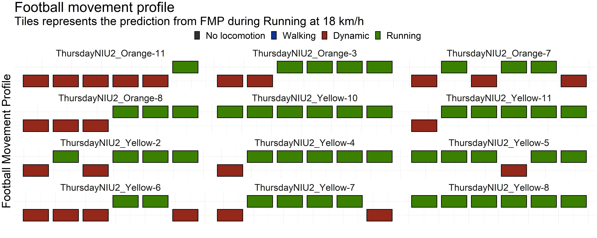
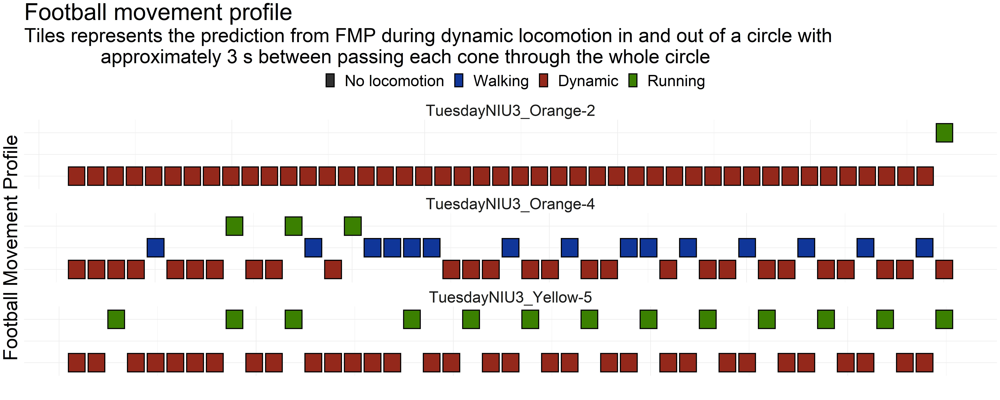
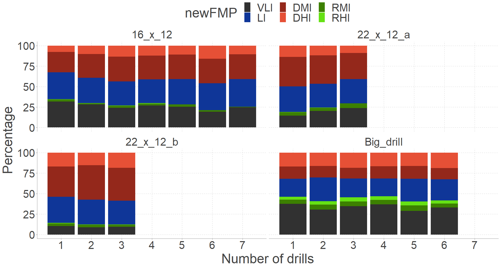
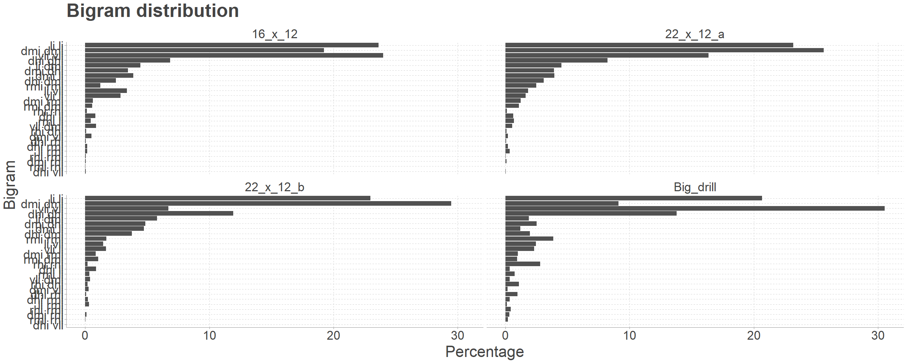
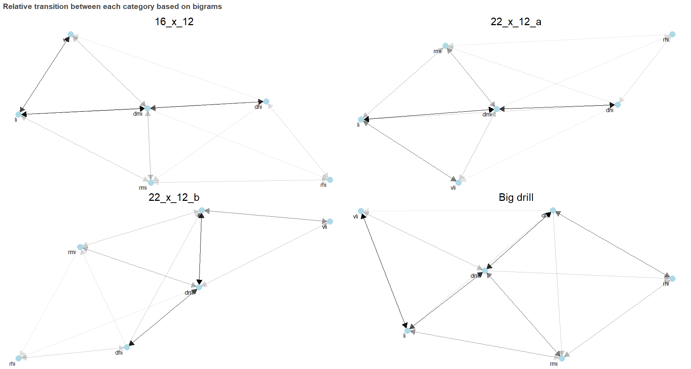

# Results
NEW
TO PASCAL:
The controlled drills part is a first draft.
The specific drills section is NOT done, and is only a few components, but it gives an idea of the plots I am gonna use to tell "a story". I have yet to actually model if it can get predicted, but it will come soon.

## Controlled Drills

The locomotion validation test was done using a percentage-agreement test between the label chosen for the drill (linear or non-linear locomotion) and the prediction from the no-intensity FMP locomotions (four categories, see figure \@ref(fig:flowchartAgreement)). Table \@ref(tab:agreement) shows the overall agreement for the controlled drills. A very good agreement can be seen for the lower velocity linear locomotions and high velocity non-linear locomotion. However, a decrease in agreement is occuring when the linear velocity increases and is also lower for the lower velocity non-linear compared to the higher velocities. 


```{r agreement, echo = FALSE, out.width = "100%"}
library(tidyverse)
library(kableExtra)

df <- data.table::fread("../Data/ProcessedData/totalAgreement.csv")


knitr::kable(df, format = "latex", align = "c", col.names = c("Drill","Velocity [km/h]","Total elapsed time [s]", "Agreement [%]"),
              digits = c(0,1,0,2), caption = "Table of the agreement between FMP locomotion and performed drills.") %>% 
   kable_minimal() %>% 
   kable_styling(latex_options = c("striped", "HOLD_position"))
```

Figure \@ref(fig:NIU2Run15) is an example of where the mis-classifications occur for the linear drill moving at 18 km/h while also showing the difference between the players, some are classified perfectly, some are not. When it miss classifies linear locomotion it is always non-linear locomotion that is classified. 
Figure \@ref(fig:NIU3mediumDynamic2) illustrated a non-linear drill with medium velocity of three different subjects performing the same drill. This shows vastly different movement patterns according to FMP which results in a lower percentage-agreement. These FMP predictions is not necessarily wrong as the the overall drill labelling does not take into account small variatons in the athletes movement pattern, though they give an indication of where FMP can be improved.


```{r NIU2Run15, fig.cap = "FMP predictions for linear locomotion at 18 km/h for some of the players. x-axis is time, y-axis is the FMP", echo = FALSE, out.width = "100%", fig.align = "center"}

```

```{r NIU3mediumDynamic2, fig.cap = "FMP predictions for non-linear locomotion at medium intensity for some of the players. x-axis is time, y-axis is the FMP", echo = FALSE, out.width = "100%", fig.align = "center"}

```

## Specific Drills

Four different drills were executed. Figure \@ref(fig:distribution) shows small variations in the FMP between the drills. The big drill has more RHI and VLI than the others, and 22_x_12_b has more DMI relative to VLI compared to the other drills. Furthermore, we can see that the relative difference between each iteration of the same drill shows low variation as the internal FMP distribution does not change much. 

The bigram distribution (see figure \@ref(fig:bigram)) illustrates that there are noticeable differences in the movements patterns between the drill types. Especially between the big drill where "VLI VLI" is the dominant bigram, and "DMI DMI" is the dominant for the 22x12 drills which corresponds with the distribution pattern from figure \@ref(fig:distribution).

```{r distribution, fig.cap = "FMP distribution for each controlled drill for each iteration. X-axis shows each iteration of the drill, Y-axis illustrated the percentage distribution.", echo = FALSE, out.width = "100%", fig.align = "center"}

```

```{r bigram, fig.cap = "FMP bigram distribution for each controlled drill. X-axis illustrated the percentage distribution and y-axis shows the FMP bigram.", echo = FALSE, out.width = "100%", fig.align = "center"}

```

Futhermore, the bigram also makes it possible to create a network plot (see figure \@ref(fig:network)) that illustrates the relative transition probability (the hue of the arrows) between each category. For an example, transition to VLI is much more frequent for the Big Drill than the other three drills, and we also see more frequent transition from DHI to RHI for the big drill relative to the others drills.


```{r network, fig.cap = "Network plot illustrating the relative transition (the hue of the arrow) between the six FMP categories.", echo = FALSE, out.width = "100%", fig.align = "center"}

```

